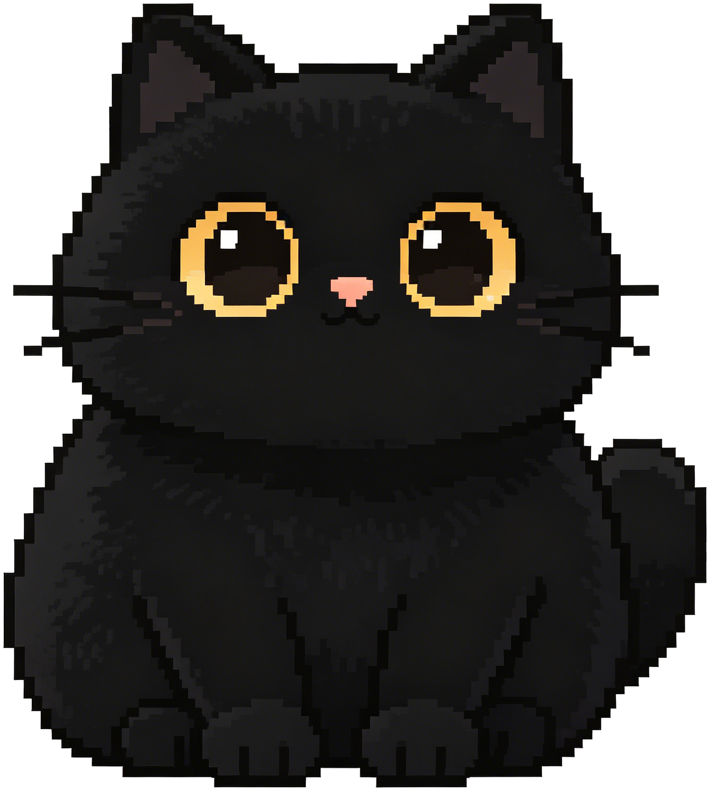

# PixelCatDesktopPet - 像素黑猫桌宠

<p align="center">
  
</p>

<p align="center">
  <strong>一只住在你桌面上的 AI 像素黑猫，陪你工作、陪你聊天、陪你摸鱼</strong>
</p>

<p align="center">
  
  
  
  
  
</p>

---

## 这个项目有什么特别的？

> **全程由 AI 辅助编程完成**，从需求分析到功能实现到部署上线，一个人 + AI，一天搞定。

这不是一个普通的桌面宠物。它融合了 **Vibe Coding** 的理念——用自然语言描述需求，AI 生成代码，快速迭代。最终交付的是一个功能完整、可直接部署的 Windows 桌面应用。

---

## 功能一览

### 像素黑猫桌宠
- **透明窗口渲染**：Win32 分层窗口技术，猫咪"悬浮"在桌面上
- **7 种动画**：跳跃、压扁、摇头、舔毛、旋转、伸懒腰、扑击
- **行走系统**：猫咪会在桌面自主巡逻，基于真实猫咪作息的随机行为权重
- **吃饭 & 睡觉**：到了饭点会吃东西，晚上会打瞌睡，还会打呼噜
- **桌面交互**：拖拽移动、滚轮缩放（5 档大小）、右键菜单
- **主动说话**：猫咪会主动跟你搭话，说些鼓励的话
- **时间感知**：根据早/午/晚/下班时间打招呼

### AI 深度对话（核心功能）
- **支持 8+ 种 API 提供商**，一键切换：

  | 提供商 | 默认模型 |
  |--------|----------|
  | DeepSeek | deepseek-chat |
  | OpenAI | gpt-3.5-turbo |
  | 通义千问 | qwen-turbo |
  | 月之暗面 | moonshot-v1-8k |
  | 智谱 AI | glm-4-flash |
  | 零一万物 | yi-lightning |
  | Ollama (本地) | llama3 |
  | 自定义 | 任意 OpenAI 兼容接口 |

- **完整聊天系统**：多会话管理、聊天记录本地持久化、流式响应
- **智能问候**：首次启动时的个性化问候语

### 本地互动（无需网络）
- **快速逗猫**：输入文字，猫咪用本地关键词匹配回复
- **休息提醒**：可自定义间隔（30/45/60/90 分钟）
- **开机自启动**：注册表自动配置，重启后自动运行

---

## 截图

<p align="center">
  
</p>

<p align="center">
  <em>像素黑猫在桌面上的渲染效果</em>
</p>

> 更多截图请查看 [screenshots/](screenshots/) 目录

---

## 技术亮点

| 技术 | 实现方式 |
|------|----------|
| 透明窗口 | Win32 `SetWindowLong` + `UpdateLayeredWindow` P/Invoke |
| 精灵动画 | `Graphics.DrawImage` + `Matrix` 变换（平移/缩放/翻转） |
| AI 对话 | OpenAI 兼容格式 HTTP API + 流式 SSE 解析 |
| 数据持久化 | JSON 序列化到 `%APPDATA%` |
| DPI 感知 | `HighDpiMode.PerMonitorV2` 支持高分屏 |
| 单文件架构 | 全部代码在 `Program.cs` 一个文件中，约 3300 行 |

---

## 快速开始

### 方式一：下载 Release

前往 [Releases](https://github.com/chenzhongyu331166-hub/PixelCatDesktopPet/releases) 下载最新版本，解压后直接运行 `像素黑猫桌宠.exe`。

### 方式二：从源码编译

```bash
git clone https://github.com/chenzhongyu331166-hub/PixelCatDesktopPet.git
cd PixelCatDesktopPet
dotnet build -c Release
dotnet run -c Release
```

**环境要求**：Windows 10/11 + [.NET 8.0 Desktop Runtime](https://dotnet.microsoft.com/download/dotnet/8.0)

---

## 项目结构

```
PixelCatDesktopPet/
├── Program.cs                  # 全部源码（单文件架构）
├── PixelCatDesktopPet.csproj   # 项目配置
├── Assets/                     # 精灵图素材
│   ├── cat.png                 # 待机状态
│   ├── cat_walk_1.png          # 行走帧 1
│   ├── cat_walk_2.png          # 行走帧 2
│   ├── cat_lick_1.png          # 舔毛帧 1
│   ├── cat_lick_2.png          # 舔毛帧 2
│   ├── cat_eat_1.png           # 吃饭帧 1（低头）
│   ├── cat_eat_2.png           # 吃饭帧 2（抬头）
│   └── cat_sleep.png           # 睡觉状态
└── docs/
    └── index.html              # GitHub Pages 落地页
```

---

## Vibe Coding 实践

本项目是 **Vibe Coding** 的实践案例：

| 维度 | 数据 |
|------|------|
| 开发工具 | OpenCode CLI + Claude 模型 |
| 开发模式 | 对话式编程，自然语言描述 → AI 生成代码 → 迭代 |
| 开发周期 | **1 天**（从 0 到可部署） |
| 代码量 | ~3300 行 C#（单文件） |
| 提交次数 | 5 次 commit |
| 核心理念 | 快速原型 → 功能迭代 → 部署上线 |

**为什么选择 Vibe Coding？**
- 传统开发需要学习 WinForms、P/Invoke、精灵动画等大量知识
- 用 Vibe Coding，直接告诉 AI "我要一个透明窗口的桌面宠物"，AI 帮你搞定底层细节
- 重点放在创意和产品设计上，而不是语法和 API

---

## 常见问题

**Q: 为什么猫咪看不到？**
A: 确保已安装 [.NET 8.0 Desktop Runtime](https://dotnet.microsoft.com/download/dotnet/8.0)。如果安装后仍看不到，尝试右键桌面 → 显示设置 → 确认缩放比例。

**Q: 如何配置 AI 聊天？**
A: 右键猫咪 → AI 聊天设置 → 选择提供商 → 填入 API Key → 保存。

**Q: 支持 macOS / Linux 吗？**
A: 当前版本仅支持 Windows。可考虑迁移至 [Avalonia UI](https://avaloniaui.net/) 实现跨平台。

**Q: 如何参与贡献？**
A: 欢迎提交 Issue 和 Pull Request！详见 [CONTRIBUTING.md](CONTRIBUTING.md)。

---

## 许可证

[MIT License](LICENSE) - 自由使用，自由分享。

---

<p align="center">
  如果这个项目对你有帮助，欢迎给个 <strong>Star</strong> ⭐ 支持一下！
</p>
